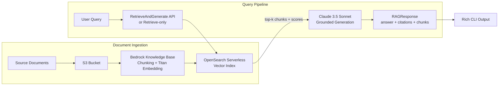

# Bedrock RAG Pipeline

Production RAG pipeline built on AWS Bedrock's native Knowledge Base service — managed chunking, embedding, and vector indexing, with Claude 3.5 Sonnet for grounded responses and built-in source citations.


> *Personal portfolio project, built and iterated Mar–Apr 2026.*

---

## The Problem

Self-managed RAG stacks require constant maintenance — chunking strategies drift, embedding models go stale, and vector DB provisioning adds operational overhead. For AWS-native teams, Bedrock Knowledge Base eliminates all of that: you upload documents, it handles chunking, embedding, and indexing automatically.

This project implements the full pipeline — ingestion, retrieval, grounded generation — using Bedrock primitives, with clean separation so you can swap any layer.

---

## Architecture



---

## Why Bedrock Knowledge Base Over DIY RAG

| Concern | DIY RAG (LangChain + Pinecone) | Bedrock Knowledge Base |
|---|---|---|
| Vector DB provisioning | Manual setup and scaling | Managed (OpenSearch Serverless) |
| Chunking strategy | Code to write and tune | Configurable, managed |
| Embedding model | Manual selection and API calls | Amazon Titan, auto-managed |
| Source attribution | Custom implementation | Native citation support |
| Infrastructure ops | Ongoing | Zero |
| Cost model | Per-query + infra overhead | Per-query only |

Bedrock KB is the production choice for AWS-native teams — this pipeline shows how to use it end-to-end.

---

## Quick Start

```bash
git clone https://github.com/TanishkaMarrott/bedrock-rag-pipeline.git
cd bedrock-rag-pipeline
pip install -r requirements.txt
cp .env.example .env
# DEMO_MODE=true by default — no AWS credentials needed

# Run end-to-end demo (ingests sample docs + 3 test queries)
python demo/run_demo.py

# Interactive query mode
python main.py

# Single query
python main.py "How does Bedrock Knowledge Base handle chunking?"
```

`DEMO_MODE=true` runs the full pipeline with realistic simulated responses — no AWS account required.

---

## Project Structure

```
bedrock-rag-pipeline/
├── rag/
│   ├── bedrock_client.py    # boto3 wrapper (agent-runtime, runtime, agent, s3)
│   ├── knowledge_base.py    # S3 upload + StartIngestionJob + polling
│   └── retriever.py         # RetrieveAndGenerate + Retrieve-only queries
├── models/
│   └── schemas.py           # Document, RetrievedChunk, RAGResponse (Pydantic v2)
├── demo/
│   ├── run_demo.py          # End-to-end demo with sample queries
│   └── sample_docs/         # Pre-loaded AWS Bedrock documentation
├── tests/
│   ├── test_retriever.py    # Retriever tests in DEMO_MODE
│   └── test_schemas.py      # Schema validation + citation deduplication
└── main.py                  # CLI entry point (interactive + single-query)
```

---

## Data Flow

### Ingestion
1. Documents uploaded to S3 via `KnowledgeBaseManager.upload_documents()`
2. `StartIngestionJob` triggers Bedrock to chunk, embed (Amazon Titan), and index into OpenSearch Serverless
3. `wait_for_ingestion()` polls until `status == COMPLETE`

### Query
1. Query string passed to `BedrockRetriever.retrieve_and_generate()`
2. Bedrock embeds query, retrieves top-k chunks by cosine similarity
3. Chunks + query sent to Claude 3.5 Sonnet for grounded answer generation
4. `RAGResponse` returned: `answer`, `retrieved_chunks` (with similarity scores), deduplicated `citations()`

---

## Key APIs

| API | Client | Purpose |
|---|---|---|
| `RetrieveAndGenerate` | `bedrock-agent-runtime` | Full RAG in one call — retrieve + generate |
| `Retrieve` | `bedrock-agent-runtime` | Retrieval only — custom generation logic |
| `StartIngestionJob` | `bedrock-agent` | Process S3 documents into the Knowledge Base |
| `InvokeModel` | `bedrock-runtime` | Direct Claude invocation for custom prompting |

---

## Configuration

| Variable | Required | Default | Description |
|----------|----------|---------|-------------|
| `DEMO_MODE` | No | `true` | Simulated responses — no AWS credentials needed |
| `AWS_ACCESS_KEY_ID` | If DEMO_MODE=false | — | AWS credentials |
| `AWS_SECRET_ACCESS_KEY` | If DEMO_MODE=false | — | AWS credentials |
| `AWS_REGION` | No | `us-east-1` | AWS region |
| `KNOWLEDGE_BASE_ID` | If DEMO_MODE=false | — | Bedrock Knowledge Base ID |
| `S3_BUCKET_NAME` | If DEMO_MODE=false | — | S3 bucket for document storage |
| `BEDROCK_MODEL_ID` | No | `claude-3-5-sonnet-20241022-v2:0` | Generation model |
| `BEDROCK_EMBED_MODEL_ID` | No | `amazon.titan-embed-text-v2:0` | Embedding model |

---

## Running Tests

```bash
pytest tests/ -v
```

All 9 tests run in `DEMO_MODE` — no AWS credentials required:

```
tests/test_retriever.py::test_retriever_demo_mode_returns_response PASSED
tests/test_retriever.py::test_retriever_demo_mode_has_chunks PASSED
tests/test_retriever.py::test_retriever_demo_mode_chunks_have_scores PASSED
tests/test_retriever.py::test_retriever_retrieve_only PASSED
tests/test_schemas.py::test_document_creation PASSED
tests/test_schemas.py::test_document_defaults PASSED
tests/test_schemas.py::test_retrieved_chunk_creation PASSED
tests/test_schemas.py::test_rag_response_citations PASSED
tests/test_schemas.py::test_rag_response_deduplicates_citations PASSED
```

---

## Key Design Decisions

**`RetrieveAndGenerate` over manual retrieval + generation** — single API call reduces latency and removes prompt construction boilerplate. The `Retrieve`-only path is available when you need custom system prompts or multi-turn context.

**Pydantic v2 for all intermediate types** — `RetrievedChunk` carries a `score` field. Without typed schemas, score thresholding logic becomes fragile. Pydantic gives fast validation and clear contracts between the retriever and its consumers.

**Deduplicated citations** — Bedrock can retrieve multiple chunks from the same document. `RAGResponse.citations()` deduplicates by source so users see each document once, not once per chunk.

---

## Related

- [ai-sentinel-ecosystem](https://github.com/TanishkaMarrott/ai-sentinel-ecosystem) — multi-agent AWS governance with quorum enforcement
- [mem0-pipeline](https://github.com/TanishkaMarrott/mem0-pipeline) — hybrid retrieval combining vector (Qdrant) and graph (Neo4j)
- [aws-sar-mcp](https://github.com/TanishkaMarrott/aws-sar-mcp) — MCP server for AWS IAM action discovery

---

## Author

Built by [Tanishka Marrott](https://github.com/TanishkaMarrott) — AI Agent Systems Engineer
